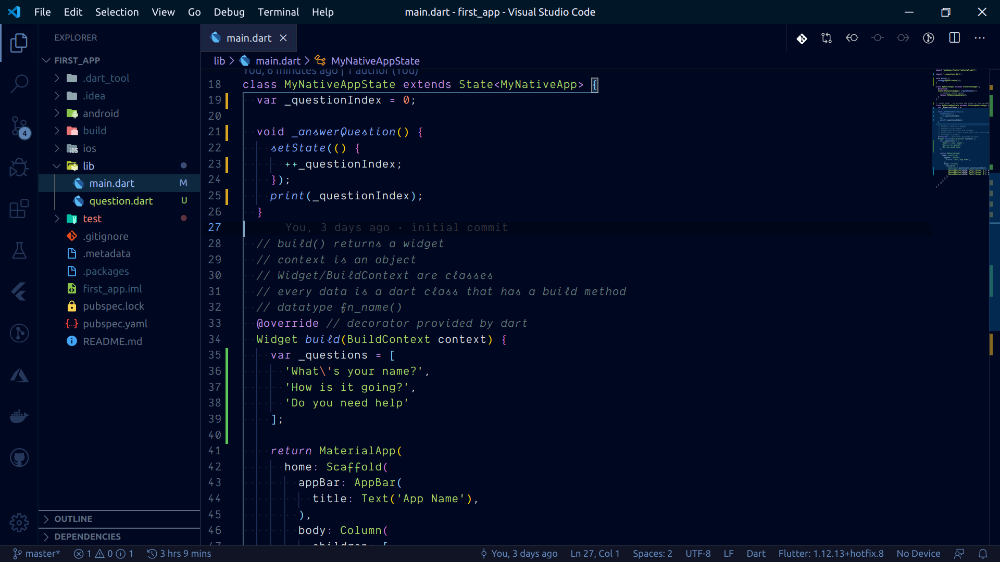
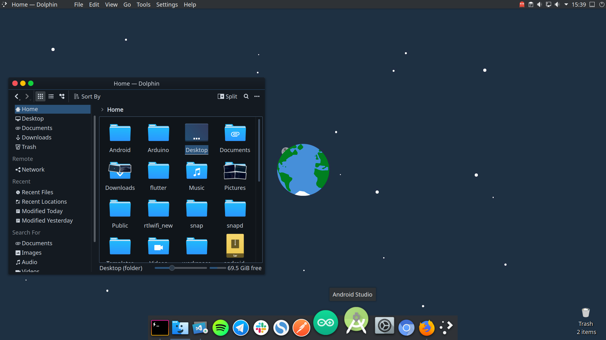
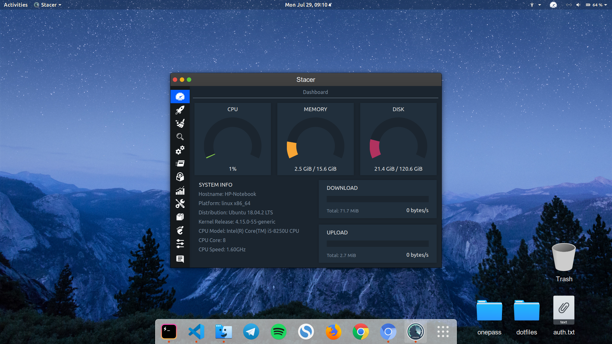
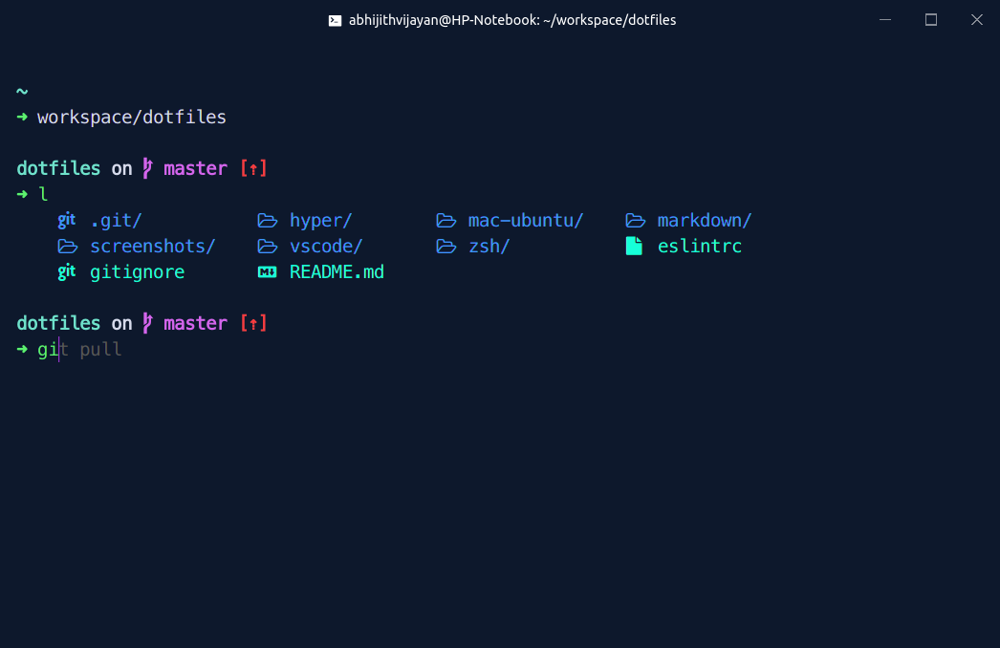
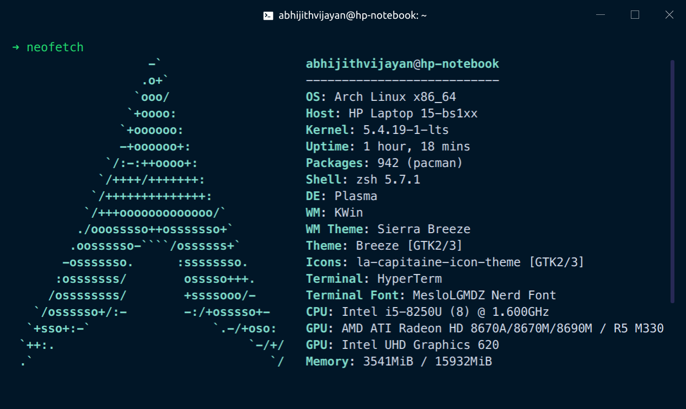
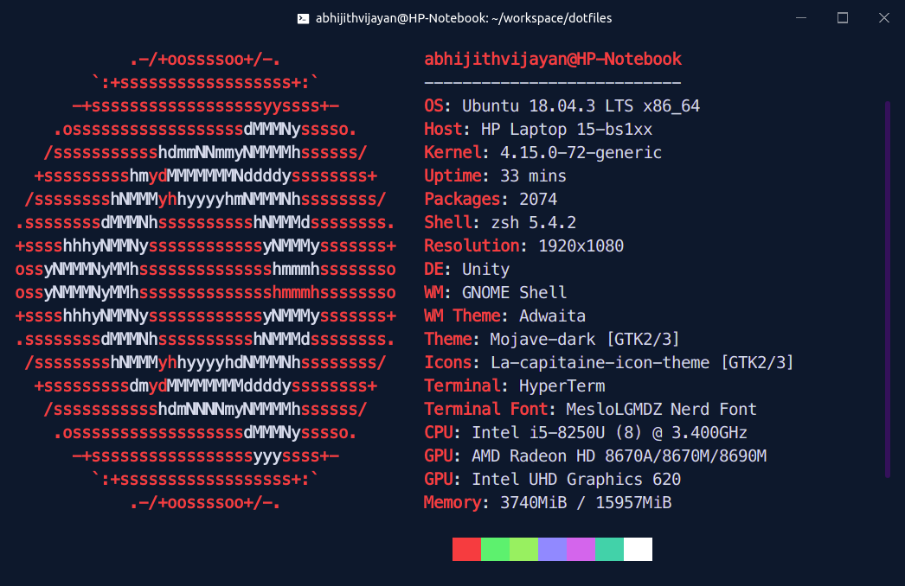

# My Dev-Env configuration files

> Zsh, VS Code, Sublime, Hyper, Linux

<h3>🙋‍♂️ Made by <a href="https://twitter.com/_abhijithv">@abhijithvijayan</a></h3>

  Donate:
  <a href="https://www.paypal.me/iamabhijithvijayan" target='_blank'><i><b>PayPal</b></i></a>,
  <a href="https://www.patreon.com/abhijithvijayan" target='_blank'><i><b>Patreon</b></i></a>

  

These are my custom config settings for different apps/editors/etc that I use in my development environment.

You may reference them and I suggest not to copy them directly coz it may / may-not break stuff(s).

#### Contents

- [VS Code](#vs-code)
- [Sublime Text](#sublime-text)
- [Arch-Linux-KDE](#arch-linux-kde)
- [Mac-Ubuntu](#mac-ubuntu)
- [Zsh](#zsh)
  - [Aliases and functions](#aliases-and-functions)
- [Hyper](#hyper)
- [Browser](#browser-extensions)

## VS Code

My main editor of choice is [VS Code](https://github.com/Microsoft/vscode) with [Night Owl](https://github.com/sdras/night-owl-vscode-theme)(customised) editor theme by Sarah Drasner and
[Dank Mono](https://dank.sh/) font by Phil Plückthun

Configs I use for it can be seen [here](vscode/). And [here](vscode/vs-code-extensions) is a list of extensions I use.

## Sublime Text

I use Sublime with [Ayu theme](https://github.com/dempfi/ayu) for quick file edits

## Arch-Linux-KDE

- Packages: [here](docs/installArchLinuxPackages.md)

## Mac-Ubuntu

- Customisation: [here](docs/customizeDevEnv.md)
- Packages: [here](docs/installUbuntuPackages.md)

## Zsh

I am using [Zsh](http://www.zsh.org) as my shell and [oh-my-zsh](https://github.com/robbyrussell/oh-my-zsh) to install all my [Zsh plugins](zsh/README.md)

### Aliases and functions

I use many aliases to get around my system as fast as possible. You can view them all [here](zsh/alias.zsh).

- Customize Dev-Env: [Instructions](zsh/README.md)

## Hyper

- Install [instructions](hyper/install.md)

## Browser Extensions

See the list of extensions/addons or theme I use [here](docs/browser-extensions-i-use.md)

<!--  -->

#### Note: These are for personal references only, please ignore the following

##### For HP Notebook 15-BS180TX

- [Battery drain](docs/fixBatteryDrain.md)
- [Dual boot time](docs/fixDualBootTime.md)
- [Graphics Drivers](docs/fixGraphicsDrivers.md)
- [Mouse Gestures](docs/fixMouseGestures.md)
- [Overheating](docs/fixOverHeating.md)
- [Shutdown Loop](docs/fixShutdownLoop.md)
- [Ubuntu Sources Issue](docs/fixUbuntuSources.md)
- [WiFi & bluetooth](docs/fixWifiAndBluetooth.md)

## Thank you

You can follow me on Twitter 
