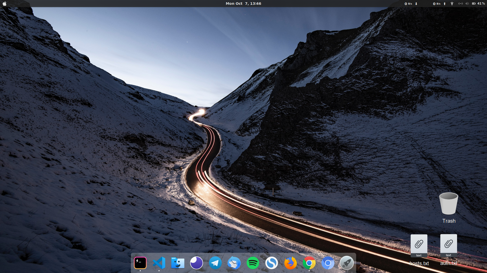

# dotfiles

These are my custom config settings for different apps/editors/etc that suits my development environment.

You may reference them and I suggest not to copy them directly coz it may / may-not break stuff(s).

## Ubuntu 18.04 LTS DevEnv

### VSCODE

Install extensions I use for VSCODE [here](markdown/vs-code-extensions-i-use.md)

### Ubuntu Packages

Follow instructions [here](markdown/installUbuntuPackages.md)

### Customize Terminal, Shell & Gnome

Setup the development environment using [instructions](markdown/customizeDevEnv.md)

### Browser Extensions

See the list [here](markdown/browser-extensions-i-use.md)

### Fixes (Specifically for HP-BS180TX)

- [Battery drain](markdown/fixBatteryDrain.md)
- [Dual boot time](markdown/fixDualBootTime.md)
- [Graphics Drivers](markdown/fixGraphicsDrivers.md)
- [Mouse Gestures](markdown/fixMouseGestures.md)
- [Shutdown Loop](markdown/fixShutdownLoop.md)
- [Ubuntu Sources Issue](markdown/fixUbuntuSources.md)
- [WiFi & bluetooth](markdown/fixWifiAndBluetooth.md)
