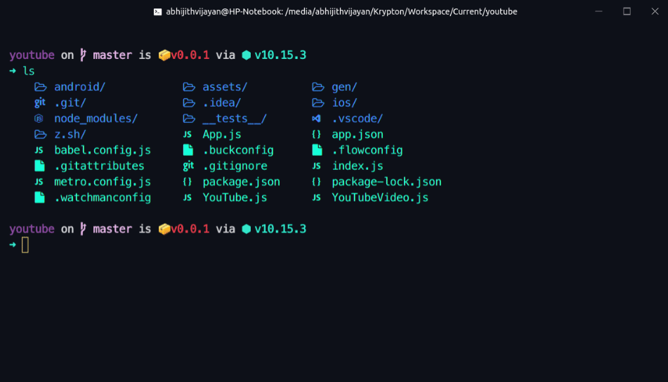

# dotfiles

## Ubuntu 18.04 LTS DevEnv




### Upgrade Packages

```
sudo apt update && sudo apt upgrade
```

### Install media codecs

```
sudo apt-get install ubuntu-restricted-extras
```

### Install GDebi

```
sudo apt install gdebi
```

### Use Flatpak

```
sudo apt install flatpak
sudo apt install gnome-software-plugin-flatpak

flatpak remote-add --if-not-exists flathub https://flathub.org/repo/flathub.flatpakrepo
```

### Enable and Start Firewall(ufw)

```
sudo ufw enable
```

### Install VLC

```
sudo apt-get install vlc -y
```

### Install Filezilla

```
sudo apt-get install filezilla -y
```

### Install Shutter

```
sudo apt-get install shutter -y
```

### Install Git

```
sudo apt-get install git -y
```

### Install curl

```
sudo apt install curl
```

### Install nvm

```
curl -o- https://raw.githubusercontent.com/nvm-sh/nvm/v0.34.0/install.sh | bash
```

### Install yarn

```
curl -sS https://dl.yarnpkg.com/debian/pubkey.gpg | sudo apt-key add -
echo "deb https://dl.yarnpkg.com/debian/ stable main" | sudo tee /etc/apt/sources.list.d/yarn.list

sudo apt-get update && sudo apt-get install --no-install-recommends yarn
```

### Eslint Config

```
npx install-peerdeps --global eslint-config-onepass
```

```
# See eslintrc dotfile for config
touch ~/.eslintrc
```

### Prolong battery life and prevent overheating

```
sudo apt install tlp tlp-rdw
sudo tlp start
```

## Customize Terminal & Shell

### Install Hyper.js

Download from :
https://hyper.is/

```
# See hyper.js dotfile for config
```

Set hyper as default terminal

```
sudo update-alternatives --install /usr/bin/x-terminal-emulator x-terminal-emulator /opt/Hyper/hyper 50
```

### Install brew

```
/usr/bin/ruby -e "$(curl -fsSL https://raw.githubusercontent.com/Homebrew/install/master/install)"
```

### Install ZSH

```
brew install zsh
sudo apt install zsh
```

Set ZSH as default shell

```
chsh -s /bin/zsh
```

### Install oh-my-zsh

```
sh -c "$(wget -O- https://raw.githubusercontent.com/robbyrussell/oh-my-zsh/master/tools/install.sh)"
```

```
# See zshrc, profile, bashrc, bash_profile dotfiles file for config
```

### Spaceship-prompt

```
npm install -g spaceship-prompt

git clone https://github.com/denysdovhan/spaceship-prompt.git "$ZSH_CUSTOM/themes/spaceship-prompt"

ln -s "$ZSH_CUSTOM/themes/spaceship-prompt/spaceship.zsh-theme" "$ZSH_CUSTOM/themes/spaceship.zsh-theme"
```

### Syntax-Highlighting

https://github.com/zsh-users/zsh-syntax-highlighting/blob/master/INSTALL.md

#### Note: if the zsh folder does not exists in /usr/local/share, just create it

```
cd /usr/local/share/zsh
git clone https://github.com/zsh-users/zsh-syntax-highlighting.git
```

### Install ruby

```
sudo apt install ruby-full -y
```

### Install powerline-fonts

```
sudo apt-get install fonts-powerline -y
```

### Install fonts manager

```
sudo apt update && sudo apt -y install font-manager
```

### Install Meslo patched font

Download zip from latest release:
https://github.com/ryanoasis/nerd-fonts/releases/latest

```
mkdir -p ~/.local/share/fonts
cd ~/.local/share/fonts
unzip Meslo.zip

sudo fc-cache -f -v
```

### Install Colorls

https://github.com/athityakumar/colorls#installation

```
sudo gem install colorls -y
mdkir ~/.config/colorls/

# See dark_colors.yaml for config
touch ~/.config/colorls/dark_colors.yaml
```

### Apply shell configuration

Update config files(see dotfiles) and then run

```
source ~/.bash_profile
```

<hr />

## Mac-OS like Customisation

### Install GNOME Tweaks

```
sudo apt install gnome-tweak-tool -y
```

### McMojave Theme

https://www.gnome-look.org/p/1275087/

https://github.com/vinceliuice/Mojave-gtk-theme

### GTK2 engines

```
sudo apt-get install gtk2-engines-murrine gtk2-engines-pixbuf

mkdir ~/.themes
mkdir ~/.icons
```

Download & extract latest tar

Move the extracted folder to `~/.themes`

open `GNOME Tweak Tool > Appearance` and select the them

### Firefox Theme

https://github.com/vinceliuice/Mojave-gtk-theme/tree/master/src/firefox

### MacUbuntu Wallpapers

http://drive.noobslab.com/data/Mac/MacBuntu-Wallpapers.zip

Extact and keep it into picture folder.

### La Capitaine Icon Set

https://github.com/keeferrourke/la-capitaine-icon-theme/releases

```
cd ~/.icons
git clone https://github.com/keeferrourke/la-capitaine-icon-theme.git
```

A Shell reload is required

`Alt+F2`

`r`

`Enter`

and then open `GNOME Tweak Tool > Appearance` and select the icons

### Change the System Font

Head to `GNOME Tweak Tool > Fonts` and set the `Windows Title` and `Interface` fonts to `Garuda Regular`.

### Add Desktop Dock

Go to `Settings > Details > About` and find GNOME shell version

and download supported version from :

https://extensions.gnome.org/extension/307/dash-to-dock/

or

https://micheleg.github.io/dash-to-dock/releases.html

#### Find installation instructions at:

https://micheleg.github.io/dash-to-dock/download.html

```
mkdir dash-to-dock@micxgx.gmail.com
```

Extract the archive contents to this directory, and move the folder to `~/.local/share/gnome-shell/extensions/`

A Shell reload is required

`Alt+F2`

`r`

`Enter`

Enable the extension with `gnome-tweak-tool > Extensions`

Set Dash background to `white` and transparency to `60%`

<hr />
