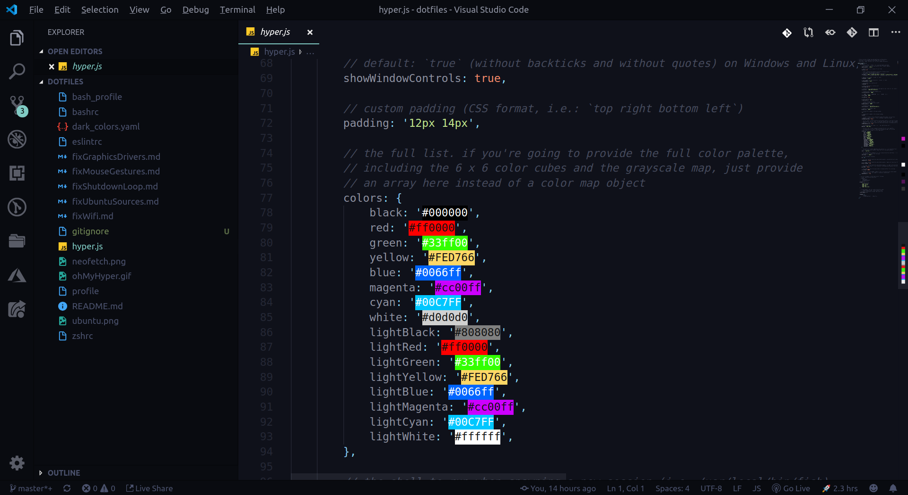

#### Here are a list of all the vscode-extensions I use.

- [Auto Close Tag](https://marketplace.visualstudio.com/items?itemName=formulahendry.auto-close-tag)
- [Auto Rename Tag](https://marketplace.visualstudio.com/items?itemName=formulahendry.auto-rename-tag)
- [Azure Account](https://marketplace.visualstudio.com/items?itemName=ms-vscode.azure-account)
- [Azure Cosmos DB](https://marketplace.visualstudio.com/items?itemName=ms-azuretools.vscode-cosmosdb)
- [Better Comments](https://marketplace.visualstudio.com/items?itemName=aaron-bond.better-comments)
- [Bracket Pair Colorizer](https://marketplace.visualstudio.com/items?itemName=CoenraadS.bracket-pair-colorizer)
- [C/C++](https://marketplace.visualstudio.com/items?itemName=ms-vscode.cpptools)
- [Code Spell Checker](https://marketplace.visualstudio.com/items?itemName=streetsidesoftware.code-spell-checker)
- [Code Time](https://marketplace.visualstudio.com/items?itemName=softwaredotcom.swdc-vscode)
- [Color Highlight](https://marketplace.visualstudio.com/items?itemName=naumovs.color-highlight)
- [DotENV](https://marketplace.visualstudio.com/items?itemName=mikestead.dotenv)
- [ES7 React/Redux/GraphQL/React-Native snippets](https://marketplace.visualstudio.com/items?itemName=dsznajder.es7-react-js-snippets)
- [ESLint](https://marketplace.visualstudio.com/items?itemName=dbaeumer.vscode-eslint)
- [File Utils](https://marketplace.visualstudio.com/items?itemName=sleistner.vscode-fileutils)
- [Git History](https://marketplace.visualstudio.com/items?itemName=donjayamanne.githistory)
- [GitLens — Git supercharged](https://marketplace.visualstudio.com/items?itemName=eamodio.gitlens)
- [GraphQL](https://marketplace.visualstudio.com/items?itemName=Prisma.vscode-graphql)
- [Import Cost](https://marketplace.visualstudio.com/items?itemName=wix.vscode-import-cost)
- [IntelliSense for CSS class names in HTML](https://marketplace.visualstudio.com/items?itemName=Zignd.html-css-class-completion)
- [JavaScript (ES6) code snippets](https://marketplace.visualstudio.com/items?itemName=xabikos.JavaScriptSnippets)
- [Lex Flex Yacc Bison](https://marketplace.visualstudio.com/items?itemName=faustinoaq.lex-flex-yacc-bison)
- [Live Server](https://marketplace.visualstudio.com/items?itemName=ritwickdey.LiveServer)
- [Live Share](https://marketplace.visualstudio.com/items?itemName=MS-vsliveshare.vsliveshare)
- [Lorem ipsum](https://marketplace.visualstudio.com/items?itemName=Tyriar.lorem-ipsum)
- [Markdown Preview Github Styling](https://marketplace.visualstudio.com/items?itemName=bierner.markdown-preview-github-styles)
- [markdownlint](https://marketplace.visualstudio.com/items?itemName=DavidAnson.vscode-markdownlint)
- [Material Icon Theme](https://marketplace.visualstudio.com/items?itemName=PKief.material-icon-theme)
- [Material Theme](https://marketplace.visualstudio.com/items?itemName=Equinusocio.vsc-material-theme)
- [MDX](https://marketplace.visualstudio.com/items?itemName=silvenon.mdx)
- [npm](https://marketplace.visualstudio.com/items?itemName=eg2.vscode-npm-script)
- [npm Intellisense](https://marketplace.visualstudio.com/items?itemName=christian-kohler.npm-intellisense)
- [Path Intellisense](https://marketplace.visualstudio.com/items?itemName=christian-kohler.path-intellisense)
- [Polacode](https://marketplace.visualstudio.com/items?itemName=pnp.polacode)
- [Prettier - Code formatter](https://marketplace.visualstudio.com/items?itemName=esbenp.prettier-vscode)
- [Project Manager](https://marketplace.visualstudio.com/items?itemName=alefragnani.project-manager)
- [Rainbow CSV](https://marketplace.visualstudio.com/items?itemName=mechatroner.rainbow-csv)
- [Settings Sync](https://marketplace.visualstudio.com/items?itemName=Shan.code-settings-sync)
- [styled-components-snippets](https://marketplace.visualstudio.com/items?itemName=jonkwheeler.styled-components-snippets)
- [Version Lens](https://marketplace.visualstudio.com/items?itemName=pflannery.vscode-versionlens)
- [vscode-styled-components](https://marketplace.visualstudio.com/items?itemName=jpoissonnier.vscode-styled-components)
